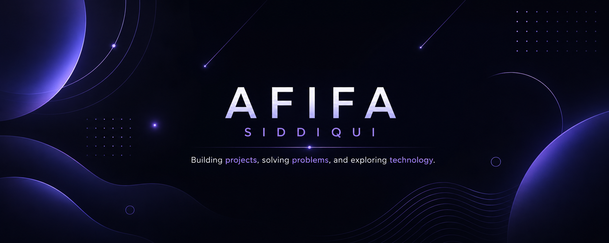

 

# Afifa Siddiqui

### Computer Science Student @ Delhi University

Curious about technology and always looking for something new to build.

 

---

## About Me

I'm a Computer Science student at Delhi University with an interest in software development, automation, and building practical digital solutions.

Through projects, I enjoy experimenting with new ideas, understanding how things work behind the scenes, and gradually expanding my skills across different areas of technology.

---

## Featured Projects

| Project | Description |
|----------|-------------|
| 📝 **QuillNest** | A blogging platform built with Next.js and Supabase featuring authentication, role-based access control, AI-powered summaries, and content management.    **Tech:** Next.js • Supabase • Tailwind CSS • Google AI API |
| 💰 **SpendWise** | Expense tracking dashboard focused on JavaScript fundamentals, LocalStorage persistence, category-wise expense tracking, and spending insights.    **Tech:** HTML • CSS • JavaScript |
| 🌍 **WanderWithMe** | One of my first web development projects, created to strengthen my understanding of HTML, CSS, and the basics of JavaScript.    **Tech:** HTML • CSS • JavaScript |
---

## Current Focus

- Building software projects
- Strengthening problem-solving and DSA
- Exploring automation workflows
- Learning new tools and technologies

---

## Tools & Technologies

**Languages**
- HTML
- CSS
- JavaScript
- C++

**Frameworks & Platforms**
- Next.js
- Supabase
- Tailwind CSS

**Tools**
- Git
- GitHub
- WordPress
- Elementor

---
